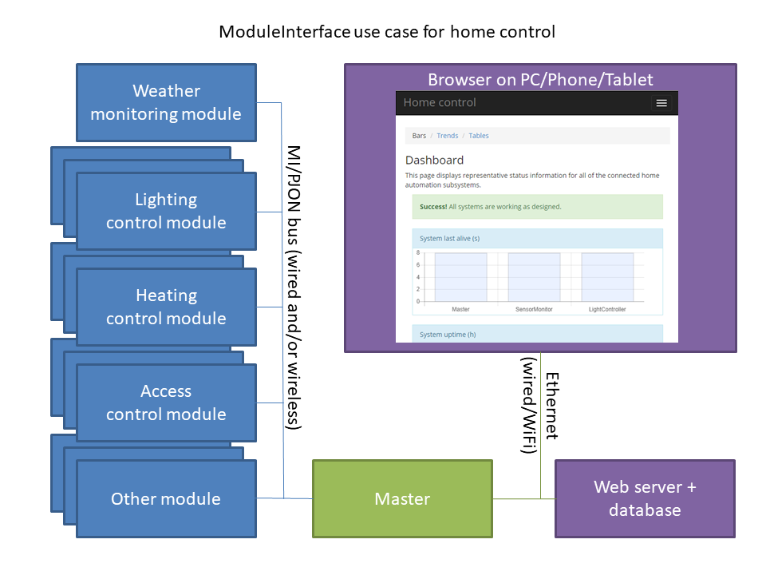
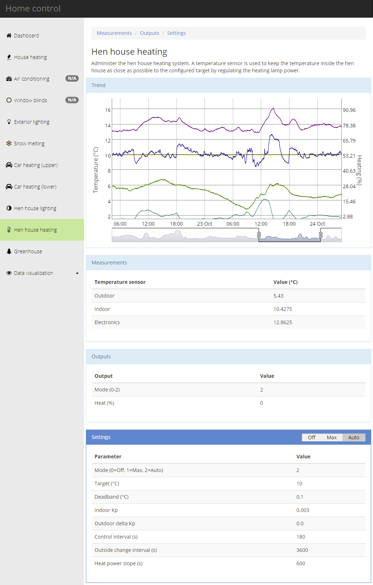

# ModuleInterface v3.1
Do you want to create a communication bus with inexpensive IoT devices in a simple way? 

Would you like web pages to configure and inspect the devices, with trend plots and historical storage?

This library enables fast and efficient setup of automation systems based on a collection of devices ("modules") controlled through a dynamic and responsive web interface. All under your control running locally with no subscriptions or cloud access required. The web interface can be easily extended and adapted to your use, or replaced with your own design.

ModuleInterface takes care of automatic transfer of settings (module configuration) and values between devices, with very little programming needed for each device. It is built on top of the [PJON](https://github.com/gioblu/PJON) communication library, allowing a wide range of devices to be connected with a single wire (no extra hardware!), Ethernet or WiFi, ASK/FSK/OOK/LoRa radio transceivers, serial, RS485 or light using LEDs or lasers.

A simple setup can consist of multiple Arduino Nano devices connected with a single wire to a master on an Arduino Mega with an Ethernet shield for communicating with the web server. No extra shields are needed for communication between the Arduinos, keeping this a low-cost but stable solution.

Other platforms than Arduino are supported, and they can be connected with different media. A collection of ESP8266 devices can communicate using built-in WiFi both between themselves and the web server. The master can also run on a Windows or Linux computer (including Raspberry PI), communicating with modules over Ethernet or WiFi.

Automatic persistence of module settings in EEPROM is supported, so that a module can continue working autonomously after a power failure even if it is isolated, if it has enough local input to meaningfully do so.

The terms _device_ and _module_ are used somewhat interchangeably in this text, with a device being a standalone Arduino, ESP8266 or similar, and a module usually being a programmed device with some attached equipment, capable of doing some actual work.



## Features
- Transport of values (measured and calculated) between modules according to their contracts
- Transport of settings between master and modules in both directions.
- HTTP client lets the master transfer settings between a database and the modules, for configuration in web pages and/or in the modules themselves.
- HTTP client lets the master save output values from the modules into a database, for time series trending and inspection in web pages
- Optional persistence lets each module remember its last received settings at startup, for autonomous operation even if it has been disconnected from the master
- Coarse clock synchronization of all modules (within a few seconds)

## How it works
It is a master-slave based system where a master can relate to multiple devices (modules) using the ModuleInterface library.

Each module does not know about any other device. The master contacts each module and retrieves its service contracts for settings, input values and output values. The master will then read and write the values in the contracts regularly at a configurable time interval, plus that a module can send values immediately as an event.

Output values from one module will be delivered to all other modules that have an input value with the same name. Values flagged as events will be distributed immediately.

Depending on the type of master used, the settings for all modules can be configured on a GUI (LCD+buttons or similar) belonging to the master or the modules, and/or retrieved from a database using the HTTP client. The settings in the database are then typically displayed in and modified from web pages.

When polling for settings from the database, the time from the database server is also retrieved, and distributed to modules as a coarse clock synchronization. This allows for modules to perform schedule based actions, working autonomously and therefore not depending on the master to be continuously available.

The optional persistence functionality lets new settings be kept and automatically updated in EEPROOM for each module. Each module can then start in its previous state immediately, before gaining contact with the master. So each module can continue working after a restart even if the master or network is down.

The ModuleInterface library consists of a collection of classes, and some files with functions for functionality like EEPROM based persistence and master HTTP transfer. The basic classes are ModuleVariable (keeping one setting or input or output value), ModuleVariableSet (keeping a set of settings or input or output values), ModuleInterface (keeping settings, input values, output values and functionality for a module), ModuleInterfaceSet (in the master -- a collection of ModuleInterface objects that are kept synchronized with the modules).

The ModuleInterface code in a master typically uses more storage space and RAM than within a module. It is still fine to run on an Arduino Uno or Nano, but when adding the HTTP client (and implicitly the large required Ethernet and ArduinoJson libraries), it is necessary to step up to an Arduino Mega or similar for the master. An ESP8266 based setup is also an alternative. The master can also be run on a RPI or on a Linux or Windows computer.

Also read the [design principles](documentation/README.md) document.

## Module implementation
Each module must declare a global object of a ModuleInterface derived class like the PJONModuleInterface that is part of the library. In the declaration of this object, the contracts (names and data types) for settings, input values and output values are specified as text parameters for simplicity.

The object's loop function must be called regularly. Contracts are exchanged automatically with the master, and settings will arrive shortly. Settings are retrieved from the object with getter functions using the same order as the contract specifies.

Measurements are registered with setter functions, and will be transferred to the master. If there are any inputs, these will be updated, and can be read with getters.

The SensorMonitor example shows the simplicity of creating a module that reads one or more sensors, to have them transported to the master and then to a database where they can be easily retrieved for display and trending in a web page. A master illustrating this is present in the ModuleMasterHttp example, ready for use (just add your own IP settings).

The SensorMonitor example is simply reading a motion detector:

```cpp
#include <MIModule.h>

PJONLink<SoftwareBitBang> link(4); // PJON device id 4

PJONModuleInterface interface("SensMon",      // Module name
                              link,           // PJON bus
                              "",             // Settings
                              "",             // Inputs
                              "Motion:b1");   // Outputs (measurements)

// Outputs (measurements) (index/position in outputs list)
#define o_motion_ix 0

#define PIN_MOTIONSENSOR 6 // Motion sensor connected to this pin

void setup() { pinMode(PIN_MOTIONSENSOR, INPUT); link.bus.strategy.set_pin(7); }

void loop() { read_sensors(); interface.update(); }

void read_sensors() {
  interface.outputs.set_value(o_motion_ix, digitalRead(PIN_MOTIONSENSOR));
  interface.outputs.set_updated(); // Flag as completely updated, all values are set
}

```

Adding reading of more sensors is done by adding more output parameters to the contract string as a space separated list, like "Motion:b1 Temp:f4" for having a variable named Temp as a 4 byte floating point value. Simple values are supported: boolean (b1), signed and unsigned byte, short and int (i1, u1, i2, u2, i4, u4), and float (f4). The digit in the data type specifies the number of bytes the data type uses.

After adding the variable, the value must be set in a similar way as the motion in the example.

For a complete list of and description of examples, look [here](https://github.com/fredilarsen/ModuleInterface/blob/master/examples/README.md).

### Variable naming convention
Each setting, input or output is identified by a variable name. A variable name consists of two parts:

1. A module prefix, as defined when declaring the module in the master. This is a two-character lower case prefix identifying the module, like "gh" for a GreenHouse module.
2. A core variable name. This must start with an upper case character, to be able to separate it from the module prefix.

Because of the low memory amount available on Arduinos, the variable name of a setting, input or output has a short maximum length. This is defined by the constant MVAR_MAX_NAME_LENGTH, and is currently set to 10 characters including the module prefix. This is supposed to be enough to give unique names to all variables, like "ghTempOut", "scServoPos" and so on. It can be overridden.

Variable names for settings and outputs within a module can be specified without the module prefix, which will be added automatically by the master when communicating with the web server / database, and when exchanging values between modules. If the module prefix is skipped, the core variable name length must still be kept 2 characters shorter than the total limit, or it will be truncated. Omitting module prefix from variable names saves a little storage space, and makes it easier to run multiple modules with the same sketch (except the PJON device id which must be unique).

Variable names for inputs must contain the module prefix for the module where they are expected to come from. For example, a GreenHouse monitoring module can specify an input with name "omTemp" to subscribe to an output with the name "Temp" in an "OutsideMonitor" module with prefix "om".

### Web pages
The included HTTP client retrieves settings from a database behind a web server and synchronizes them to all modules that have any settings. It also logs all outputs (measurements and states) from all modules to a database behind the web server.

PHP scripts and a database scheme plus instructions are included, making it easy to get the transfer of settings and values up and running in a standard, free LAMP or WAMP setup (Linux/Windows + Apache + MySQL/MariaDb + PHP) on your computer.

A sample web site is included in the examples, controlling a light controller module that subscribes to an ambient light measurement from another module. Measured ambient light is shown as current value and in trend plots along with the power output from the light controller. The settings used by the controller, a time interval and a ambient light limit, can be edited in the web page and is synced to the light controller.
The sample web site can be used as a starting point for your own site.

Here is a snapshot of a responsive home automation web site in production, running on a server on a LAN, with access from the outside and mobile phone through VPN:




### Dependencies and credits
This library depends on the following libraries in addition to the Arduino standard libraries:

* [PJON](https://github.com/gioblu/PJON) for communication between modules
* [ArduinoJSON](https://github.com/bblanchon/ArduinoJson) for communication between master and web server

### License
```cpp
/* Copyright 2016-2018 Fred Larsen

Licensed under the Apache License, Version 2.0 (the "License");
you may not use this file except in compliance with the License.
You may obtain a copy of the License at

    http://www.apache.org/licenses/LICENSE-2.0

Unless required by applicable law or agreed to in writing, software
distributed under the License is distributed on an "AS IS" BASIS,
WITHOUT WARRANTIES OR CONDITIONS OF ANY KIND, either express or implied.
See the License for the specific language governing permissions and
limitations under the License. */
```
