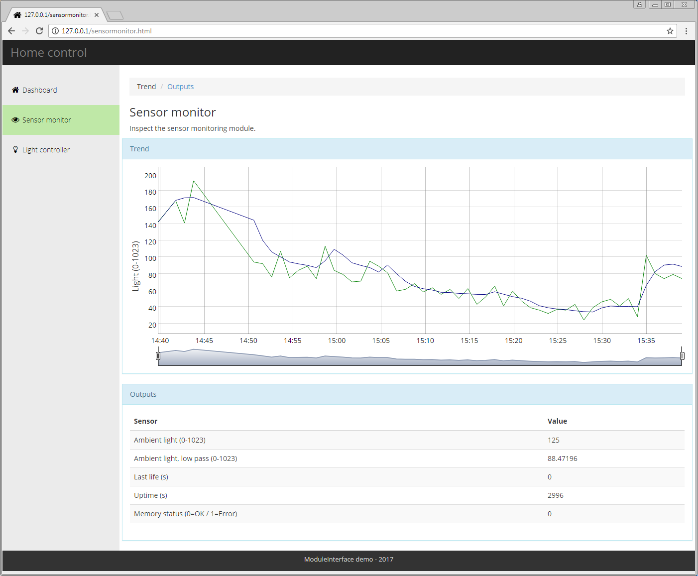
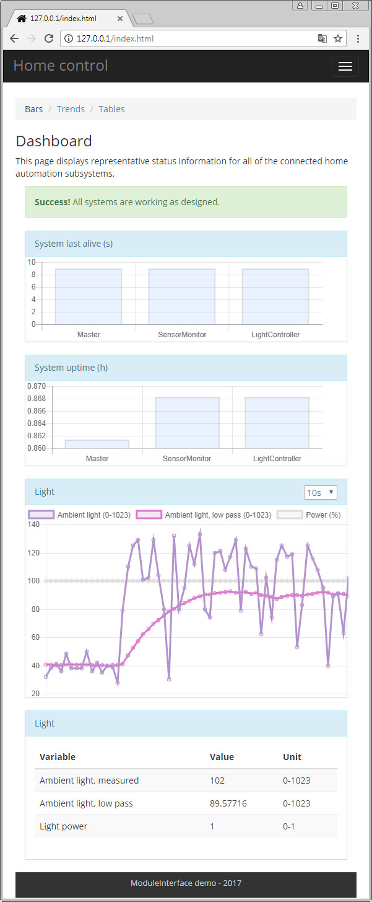

## WebPage example
This is not a single sketch, but a recipe of how to set up a complete setup with two modules being visualized and controlled from a web page. It shall be easy to add more modules to this setup.

A "module" is simply a device like Arduino Nano equipped with necessary equipment like sensors, servos, relays etc, programmed with a sketch that communicates with a ModuleInterface master.

### Components
1. A SensorMonitor module, for example running on an Arduino Uno or Nano. This module simply reads a light sensor and reports it to the master.
2. A LightController module, for example running on an Arduino Uno or Nano. This module subscribes to the light sensor reading from the SensorMonitor, and gets settings like time interval and light limit from the Master for controlling the light. In this example it only controls the on-board LED. It reports the current light state (or or off) to the master.
3. A ModuleMasterHttp module running on an Arduino Mega (because of memory requirements) with an Ethernet shield. This will transfer settings from the database and outputs to the database using JSON and HTTP requests.
4. A computer with a LAMP/WAMP setup. For example  or .

There are two sets of modules available in this example, in the ARDUINO_SWBB and ESP8266_GUDP directories. You should run one set at a time, unless you change one of the masters to avoid conflict of IP, master prefix and module prefixes. Running multiple setups or a mixed setup is possible, but keep it simple to start with.


Arduino-based setup using PJON SWBB (SoftwareBitBang) on a single wire


ESP8266-based setup using PJON GUDP (GlobalUDP) over WiFi

### Pages
The web page example consists of a Dashboard that is meant to show key information from all modules in one place, plus one page per module. This is how it is meant to look:





This is how it will look when viewed on a narrow screen like a mobile phone:


### Configuration of SensorMonitor
Program a device with the SensorMonitor sketch. Connect the analog pin of a light sensor to pin A0 (plus ground and voltage to sensor, of course). Connect pin 7 to the PJON bus on pin 7 of the master. Connect device ground to ground on the master.

### Configuration of LightController
Program a device with the LightController sketch. Connect pin 7 to the PJON bus on pin 7 of the master. Connect device ground to ground on the master.

### Configuration of ModuleMasterHttp
 The master must have a correct network configuration for the network to which it is connected. This includes:
 - A unique MAC address, just fiddle with the MAC address in the sketch.
 - A unique IP address. The example use a fixed IP address for simplicity and to not be depending on a DHCP server being present. Make sure that the assigned IP address is outside any DHCP pool in your router if you want this as a permanent setup.
 - The IP of your gateway, normally the router address. This is not strictly needed if the web server is on the same network segment.
 - The network mask for your network. Normally the mask is 255.255.255.0.

The master must also know the IP address of your web server.

After modifying the network and IP addresses in the ModuleMasterHttp sketch, program a Mega with this.

Then add an Ethernet shield to the Mega, connect a CAT5 cable between the shield and your network switch or router, then power on.

### Installation of web server and database
Run the XAMPP or WampServer installation package.

### Configuration of database
1. Start Apache and MySQL/MariaDb and open the phpMyAdmin page. Or use a similar tool, like HeidiSQL if you want to keep your htdocs directory clean from other stuff. If you use the XAMPP distro, you can start phpMyAdmin by opening ```http://localhost/applications.html``` in the browser and clicking phpMyAdmin on the top right.
2. Go to the Import tab and run the "database setup/home_control.sql" file to create the required tables. The character set must be set to UTF-8.
3. You now have the home_control database running. Data should be updated in the currentvalues table after a short while, and you can inspect this (in phpMyAdmin by clicking on the table name to refresh the data).

### Configuration of web server
1. The files from the "htdocs" folder are copied into the "C:/xampp/htdocs" folder (depending on installation). Unfortunately, XAMPP has a lot of files present here to supply phpMyAdmin etc, so it will be a mix. Some Other WAMP/LAMP distros keep the htdocs directory empty and supply database management tools like the native program HeidiSQL.
2. The db_config.php file edited to contain the selected database name, user name and password. Initially the password will be empty, so get it working before setting a password.

### Testing
When all is up and running, check this:
1, Are values updated in the currentvalues table?
2. Are new rows being created in the timeseries table? You can inspect the table with HeidiSQL or phpMyAdmin.
3. Are you getting the values shown in the plot in the web page?
4. Can you change the LightController mode (on/off/auto) and see the on-board LED reflect this after maximum 10 seconds?

### Debugging
If it does not work right away, you can try the following steps.
1. Try to manually get settings from the database by inputting the following in the address field of a browser on the web server:
   ```http://localhost/get_settings.php```
   You should see a JSON string with all available settings. If not, web server and database setup must be checked. You should get an error message in the browser. Try to use this to find out what is wrong. Check db_config.php.
2. Try to manually get current values from the database by inputting the following in the address field of a browser:
      ```http://localhost/get_currentvalues.php```
   You should see a JSON string with all current values. If not, use another tool like HeidiSql for checking if rows have been created in the currentvalues table (most relevant if you have added new modules or more variables). But you should get a nice JSON response with names and values.
3. If manual tests succeed but there are no values delivered from the master, re-check the master device IP settings and try programming the master again, and check all connections.
4. Run a scan and see if the ModuleMasterHttp is present in your network. A simple way to do this is to run the free app "Fing" on an Android phone or tablet. You should see the IP address you assigned to your master present in the Fing list.

### Credits
The web page example is based on the following:
* [Bootstrap](https://getbootstrap.com/) (MIT license)
* [Chart.js](http://www.chartjs.org/) for live plots on the dashboard page (MIT license)
* [d3](https://github.com/d3/d3/wiki/gallery) (BSD-3 license)
* [dygraphs](http://dygraphs.com/) for charts on the module pages (MIT license)
* [jQuery](https://jquery.com/) (MIT license plus referencing ```https://jquery.org/license```)
* [font-awesome](http://fontawesome.io/) (SIL OFL 1.1 license)
* [templatemo](http://www.templatemo.com/) for the starting point (Creative Commons 4.0 International license)
